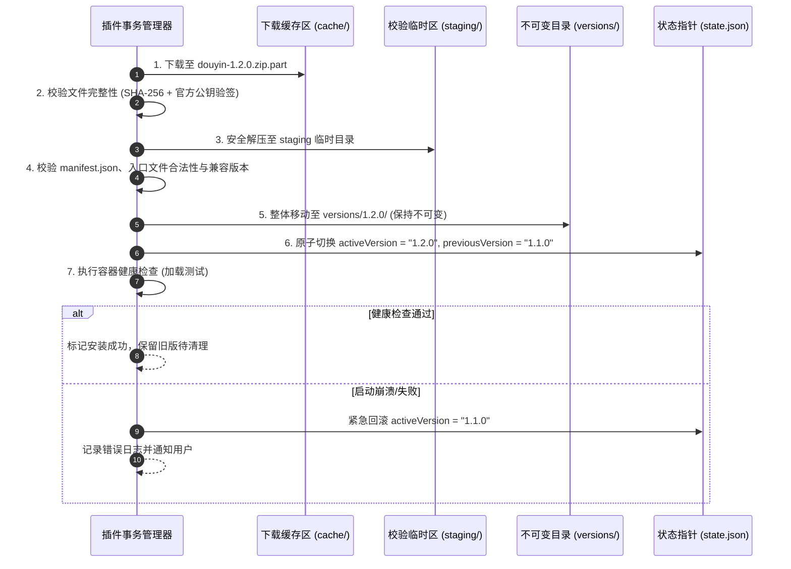

# 豆角工具箱 (Doujiao) 插件化系统工程规格书 (V2.0)

> 本文档由 [`PLUGIN_SYSTEM_DESIGN.md (V1)`](./PLUGIN_SYSTEM_DESIGN.md) 吸收 [`PLUGIN_SYSTEM_DESIGN_REVIEW.md`](./PLUGIN_SYSTEM_DESIGN_REVIEW.md) 评审意见后升级而成，作为系统工程级落地规格指导。

---

## 1. 架构目标与工程指标

### 1.1 核心设计定位
- **轻量可信宿主**：主程序仅提供核心系统底座（窗口管理、进程隔离容器、权限代理代理层、通用流式下载队列、不可变版本事务管理器）。
- **按需沙箱化安装**：初次安装包不预置业务下载模块，按需从经签名的官方市场下载。插件在严格沙箱中运行，无 Node.js 特权。
- **不可变版本与指针切换**：避免可变目录覆盖，插件以多版本目录不可变存放，通过版本指针实现可恢复、防损坏的原子切换。
- **供应链与数字签名保护**：宿主内置公钥验签，彻底防御中间人劫持与恶意代码注入。
- **宿主持有长期任务**：长时间的视频下载与转码任务由宿主生命周期持有，插件视图更新或关闭不打断正在进行的下载任务。

### 1.2 体积与性能量化指标

| 指标项 | 目标基准 | 工程保障措施 |
| :--- | :--- | :--- |
| **纯净宿主安装包** | ≤ 45 MB | 剥离下载业务代码；FFmpeg 转为按需扩展；评估富文本/编辑器等非核心依赖延迟加载 |
| **单个插件包体积** | 100 KB ~ 2 MB | 插件仅包含 UI 视图与前端解析逻辑，轻量依赖单文件化打包，排除重型依赖 |
| **FFmpeg 独立扩展包** | 约 80 MB (7z 压缩后约 30MB) | 存放于宿主全局共享池 `userData/bin/`，首次需要音视频合并时提示用户一键下载 |
| **冷启动额外开销** | ≤ 300 ms | 插件元数据本地缓存，采用按需懒加载，不占用后台常驻内存 |

---

## 2. 信任模型与安全边界

### 2.1 V1 信任模型与边界原则
1. **仅支持官方签名插件**：第一阶段不开放不可信第三方生态，所有在插件市场分发的元数据与包必须经过官方私钥签名，宿主内置公钥强校验。
2. **禁止插件注入主进程**：V1 严禁插件在主进程（Main Process）动态执行任意 Node.js 代码。所有文件写入、网络请求、会话 Cookie 获取、FFmpeg 执行均通过宿主受控能力代理。
3. **宿主安全基线先决加固**：
   - 宿主主窗口强制开启 `sandbox: true`，`contextIsolation: true`；
   - 拦截任意 `http(s)` 页面导航，外部链接通过协议与域名白名单校验后交由系统默认浏览器打开；
   - 全面禁用 `<webview>` 或关闭 `allowpopups`；
   - 插件资源统一通过自定义安全协议 `doujiao-plugin://` 加载，严格禁止使用 `file://`。

---

## 3. 进程架构与运行时容器

```text
+-------------------------------------------------------------------------------+
|                             可信宿主环境 (Host Zone)                           |
|                                                                               |
|  [宿主主进程 Main Process]                                                    |
|  ├── 插件事务管理器 (下载/解压安全校验/验签/不可变指针切换/版本回滚)             |
|  ├── 权限鉴权代理 (根据 sender WebContents 强校验调用者身份与授权能力)           |
|  ├── 集中式任务引擎 (持有所有活跃下载流、进度广播、断点续传与取消句柄)         |
|  ├── 敏感数据隔离区 (安全存储用户 Cookie、系统配置与敏感凭据)                 |
|  └── 共享服务进程池 (受控执行 FFmpeg 音视频合并、系统通知)                     |
|                                                                               |
|  [宿主外壳渲染窗口 Host Shell Renderer]                                       |
|  └── 插件市场 UI、导航侧边栏、Tab 标签页容器、全局下载托盘浮窗                  |
+-------------------------------------------------------------------------------+
                                      ▲
                                      │ 插件专属受控 IPC 通信 (MessagePort / RPC)
                                      ▼
+-------------------------------------------------------------------------------+
|                          插件沙箱容器 (Plugin Sandbox View)                   |
|                                                                               |
|  [独立 WebContentsView]                                                        |
|  ├── sandbox: true, contextIsolation: true, nodeIntegration: false           |
|  ├── CSP: 限制脚本与样式来源，禁止内联 eval                                  |
|  ├── 宿主注入的受控 Plugin SDK (禁止插件包自带 preload)                         |
|  └── 纯 UI 渲染 + 无特权前端解析逻辑 (React / Vue 组件与样式)                  |
+-------------------------------------------------------------------------------+
```

### 3.1 插件通信与权限鉴定机制
- **调用来源鉴定**：宿主 IPC Handler 必须通过 `event.senderFrame` 或 `event.sender.id` 反查对应插件注册上下文，**严禁信任插件传入的 `pluginId` 参数**。
- **能力代理模式**：
  - 插件不直接拿到用户的 B站/抖音 Cookie，而是由插件向宿主申请发起到特定域名（如 `*.douyin.com`）的受控代理请求，宿主自动附加必要 Cookie 与安全 Header。
  - 登录流程由宿主弹出独立隔离窗口捕获 Cookie 并由主进程持久化，不暴露明文给沙箱渲染层。

---

## 4. 插件元数据与能力清单规范 (`manifest.json`)

每个插件根目录下包含经过校验的 `manifest.json`：

```json
{
  "$schema": "https://doujiao.app/schemas/plugin-manifest.v2.json",
  "id": "douyin-downloader",
  "publisher": "doujiao-official",
  "name": "抖音视频/合集下载器",
  "version": "1.2.0",
  "description": "支持抖音无水印单视频、主页作品、合集与专题批量下载",
  "icon": "assets/icon.png",
  "engines": {
    "doujiao": ">=0.2.0 <0.3.0",
    "pluginApi": "^1.0.0"
  },
  "entrypoints": {
    "ui": "dist/index.html"
  },
  "permissions": [
    {
      "capability": "network.request",
      "hosts": ["www.douyin.com", "*.douyinvod.com", "*.amemv.com"],
      "methods": ["GET", "POST"]
    },
    {
      "capability": "download.enqueue",
      "formats": ["mp4", "mp3"]
    },
    {
      "capability": "browser.login",
      "domain": "douyin.com"
    },
    {
      "capability": "media.merge"
    }
  ],
  "requires": {
    "host.media.ffmpeg": ">=6 <8"
  }
}
```

### 4.1 字段核心规则
- **`engines` (SemVer 范围)**：弃用单一的 `minAppVersion`，严格定义兼容的宿主版本区间与 `pluginApi` 主版本。
- **结构化权限能力**：权限细化到域名与能力维度。版本更新时，若新增或扩大了权限作用域，系统将**暂停静默激活**，要求用户显式确认授权。
- **`requires`**：声明对宿主共享扩展能力的要求（如特定版本区间的 FFmpeg）。

---

## 5. 远端插件市场与供应链安全 (Registry)

远端中心索引文件 `plugins-registry.json` 保留多版本历史，支持旧版本宿主匹配最高兼容插件，并使用 Ed25519 进行数字签名。

```json
{
  "schemaVersion": 2,
  "registryVersion": 108,
  "updatedAt": "2026-09-09T15:30:00Z",
  "expiresAt": "2026-09-16T15:30:00Z",
  "plugins": [
    {
      "id": "douyin-downloader",
      "publisher": "doujiao-official",
      "name": "抖音下载器",
      "description": "抖音全场景无水印下载",
      "iconUrl": "https://assets.doujiao.app/plugins/douyin/icon.png",
      "releases": [
        {
          "version": "1.2.0",
          "channel": "stable",
          "publishedAt": "2026-09-09T12:00:00Z",
          "changelog": "1. 修复合集分页解析失败；2. 增加专题批量推入队列。",
          "engines": {
            "doujiao": ">=0.2.0 <0.3.0",
            "pluginApi": "^1.0.0"
          },
          "permissions": [
            { "capability": "network.request", "hosts": ["www.douyin.com", "*.douyinvod.com"] },
            { "capability": "download.enqueue" }
          ],
          "artifacts": [
            {
              "platform": "win32",
              "arch": "x64",
              "url": "https://github.com/your-org/doujiao-plugins/releases/download/douyin-v1.2.0/douyin-downloader.zip",
              "size": 184320,
              "sha256": "8f481a50c822b3b88c7f212850fba205d1de520b73c914e9f7cc9eb482a5c48b",
              "signature": "d38b...base64_ed25519_signature..."
            }
          ]
        }
      ]
    }
  ]
}
```

### 5.1 ZIP 解压安全防御规范
解压插件包时，解压模块必须实施以下硬性防御检查：
1. **防止 ZipSlip**：严格校验相对路径，拦截所有包含 `../`、绝对路径或 UNC 路径的文件条目；
2. **符号链接拦截**：严禁创建软链接、硬链接（Symlink/Junction），防止指针逃逸至系统敏感目录；
3. **防止解压炸弹**：限制单文件最大体积（≤ 20MB）、总解压体积（≤ 100MB）及总文件条目数（≤ 500 个）；
4. **禁止危险可执行文件**：包内不得包含 `.exe`、`.bat`、`.cmd`、`.dll`、`.node`（原生模块）或私自携带的 preload 脚本。

---

## 6. 不可变版本存储与事务安装

### 6.1 目录划分隔离

```text
userData/
├── plugins/
│   └── douyin-downloader/
│       ├── state.json                     # 版本状态指针 (记录 activeVersion 等)
│       └── versions/
│           ├── 1.1.0/                     # 旧版本目录（只读、不可变，可随时快速回滚）
│           └── 1.2.0/                     # 当前激活版本目录（只读、不可变）
├── plugin-data/
│   └── douyin-downloader/                 # 插件私有持久化数据（与安装包彻底分离，更新不丢失）
│       └── preferences.json
├── cache/
│   └── plugin-downloads/                  # 临时下载与解压 staging 缓存区
└── bin/                                   # 共享服务组件
    └── ffmpeg/
        └── 7.0.1/
            └── win32-x64/
                └── ffmpeg.exe
```

### 6.2 事务式安全安装与切换流程



### 6.3 Windows 文件锁定与灾难恢复
- **解决文件锁定**：新版本解压至全新的 `versions/1.2.0/`，完全不触碰运行中 `versions/1.1.0/` 的任何被占用文件。
- **启动自动恢复**：宿主每次冷启动时检查 `state.json` 与事务日志，若发现因断电造成的未完成临时文件，自动执行清理或回退至最后一次健康的版本指针。

---

## 7. 任务生命周期与无中断激活

### 7.1 宿主持有长期任务
- **任务脱耦**：下载队列、活动网络流、合并中转码句柄由宿主主进程的 `DownloadTaskManager` 统一保管与持久化。
- **防止中断**：即使插件沙箱页面发生重载、崩溃或用户切换 Tab，后台下载进度丝毫不受影响。

### 7.2 插件生命周期规范
沙箱容器中的插件遵循标准生命周期约束：
```typescript
interface PluginLifecycle {
  // 容器挂载后调用，传递受控 SDK 上下文
  activate(context: PluginContext): Promise<void>;
  
  // 视图隐藏、切换或即将升级时调用，插件清理定时器与事件监听
  deactivate(): Promise<void>;
  
  // 插件被卸载或彻底销毁时清理资源
  dispose(): void;
}
```

### 7.3 安全激活时机
- 当新版本下载并解压成功后，**不在插件执行核心操作（如解析中）时粗暴刷新**。
- **激活时机**：当插件处于空闲状态、用户主动点击“刷新生效”或者用户下次进入该插件页面时才完成指针生效与页面重载。

---

## 8. 实施路线图 (Phased Roadmap)

```text
阶段 0: 宿主安全基线加固与契约规范 (当前重点)
  ├─ 修复主窗口 sandbox 配置，加固 IPC 鉴权体系
  ├─ 定义 Plugin API 规范 (TypeScript 声明文件)
  └─ 搭建不可变版本目录结构与路径规划

阶段 1: 沙箱运行时原型验证
  ├─ 实现基于 WebContentsView 的隔离容器与安全协议 doujiao-plugin://
  ├─ 注入受控 SDK 代理（网络请求、下载任务推入）
  └─ 选定一个插件（如抖音解析）迁移至独立沙箱，验证完整下载链路

阶段 2: 不可变版本事务与本地安装器
  ├─ 实现 ZIP 防御性解压算法 (ZipSlip/炸弹防护)
  ├─ 实现版本状态指针 (state.json) 与健康检查回滚机制
  └─ 本地导入与手动加载测试

阶段 3: 签名 Registry 与中心市场
  ├─ 搭建中心 Registry 索引与 Ed25519 签名发布工具链
  ├─ 宿主端验签与多版本兼容选择器
  └─ 宿主主窗口实现「插件中心 UI」（展示市场列表、版本日志、安装/卸载）

阶段 4: 自动更新与高级能力建设
  ├─ 后台空闲静默下载与就绪提醒
  ├─ 权限变更强提醒与授权弹窗
  └─ FFmpeg 独立组件按需下载器
```
